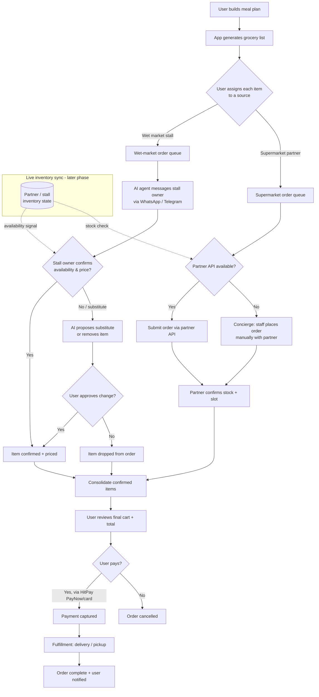

# FEATURES — Chef HideOut 私厨 (build reference)

**What this is:** the **development source of truth** for the web app — every feature, what it does, its build status, and *how to build it* (data, flow, decisions). If you're writing code for a feature, this is the file to read.

**How it relates to `ROADMAP.md`:** `ROADMAP.md` is the **business overview** — the overarching progress checklist across product, company, legal, BD, and growth. It tells you *what to work on next and where it sits in the plan*. This file tells you *what each feature is and how to build it*. Roadmap items point here (`→ FEATURES §n`) for the build detail.

**Phases** (shared with `ROADMAP.md`):
- **Phase 1 — Soft Launch:** the pre-launch product + company groundwork.
- **Phase 2 — Monetization Pilot (month 4+):** payments + concierge grocery ordering; needs signed suppliers.
- **Phase 3 — Scale (later):** live inventory + partner APIs, native apps, 繁體/HK content, paid acquisition.

**Last updated:** 2 Aug 2026

---

## Status legend

| Symbol | Meaning |
|---|---|
| ✅ | **Built** — live in the app today |
| 🔨 | **In progress** — partially built or built-but-uncommitted, awaiting review |
| 📋 | **Planned** — accepted, not yet built (phase noted per feature) |
| 🔮 | **Deferred** — needs partnerships, volume data, or funding first |

---

## At-a-glance feature status

| # | Feature | Status | Phase | Note |
|---|---|---|---|---|
| 1 | **Community & social + "overlays" (forking)** | 🔨 mostly built | 1 | "Overlay" = the forking/variations MVP (built, uncommitted) |
| 1b | **Meal-plan sharing incl. festive/seasonal** | ✅ sharing / 📋 festive tag | 1 | Festive/seasonal = **user-tagged category** (community-filled) |
| 2 | **UX: browse, easy upload, grocery list** | ✅ core / 📋 additions | 1 | Offline list, duplicate nudge, import-accuracy pass still 📋; **buying through the app** is Phase 2 |
| 3 | **Chef credits & content licensing** | 🔨 partial | 1 | Attribution exists; formal creator agreements + AI photos to come |
| 4 | **Asian-accurate calorie + nutrient engine** | 🔨 AI-only today | 1 | Move from AI-guess to **HPB database + AI matching** |
| 5 | **Grocery shopping & fulfillment** | 🔮 | 2 → 3 | Wet market + supermarkets; phased concierge → AI routing → live inventory |
| 6 | **AI customer service + Telegram escalation** | 📋 | 1 | Chatbot + escalation to owner via Telegram |
| 7 | **Bilingual (EN / 简体)** | ✅ UI / 📋 content auto-translation | 1 / 3 | 繁體 (HK) content moved to Phase 3 |
| 8 | **PWA now, native apps later** | 📋 PWA / 🔮 native | 1 / 3 | Native only on proven demand |

---

## 1. Community & Social

> **Vision:** a place people go before their week's meals the way they open a social feed — browse what others are cooking, follow chefs they trust, react and comment, and take a recipe someone else made and make it their own. Cooking becomes social, not solitary.

**What it does**
- **Recipe feed / discovery** — `Explore` and `Discover` pages to browse public recipes. ✅ Built
- **Social interactions** — follow chefs, comment (threaded, with photos), like/rate recipes. ✅ Built (migration `025_social_layer_content_licensing`)
- **Chef profiles & directory** — public chef pages and a browsable directory. ✅ Built (migrations `026`–`028`); a **profile upgrade** (bio, specialty tags, IG/YouTube links, follower + recipe showcase) is 📋 Phase 1.
- **Profile recipe ordering — decided (2 Aug 2026):** a member's public profile shows their **original recipes first, then their imported ones**. Today imports are hidden entirely (`source_url is null` filter), so this is a small query + ordering change. 📋 Phase 1 (ships with the profile upgrade).
- **"Overlays" = recipe forking / variations** — take any public recipe, make your own version ("Make it your own"), with a required note on what you changed and a "Based on [chef]'s [dish]" credit banner to the original. 🔨 Built as an MVP (uncommitted, awaiting test); migration `029_recipe_variations` is already live.

**Design decision — materialized fork, not live overlay:** a fork is a *full copy* of the recipe row, **not** a delta/overlay table. Rationale: an overlay would force base+overlay merging into every consumer of recipe data (nutrition, grocery generation, meal-plan slots, translation, search) — a permanent complexity tax. A full copy means zero downstream changes.

**Build detail — forking**
- **Schema (migration `029`, already live):**
  - `original_recipe_id` = fork pointer to the immediate parent (fork chains allowed); FK `ON DELETE SET NULL`; index on `original_recipe_id`.
  - `variation_note TEXT` — the user's own words on what changed and why. **Required** (prompt if empty).
  - `variation_diff JSONB` — reserved for an auto-computed diff (ingredients/steps/servings changed). **Column exists but is unused in the MVP** (see Deferred).
- **Fork flow:** button on public recipe pages (logged-in users; hidden on your own recipes) → prefills the edit form with a copy (**no DB insert until save**) → on save: `user_id` = forker, `is_public = false` (private by default per IP policy), counters reset to 0, **`hero_image_url` NOT copied** (photo belongs to the original author — AI placeholder or own photo instead), `_zh`/`_zh_hant` fields copied then re-translated for any edited field → insert.
- **Display:** original page shows **"Variations (N)"** listing *public* forks; fork page shows a **"Based on [author]'s [title]"** banner linking the original; listing cards get a small **"🔀 Variation"** tag; the "User's Original" hero badge is gated on `!original_recipe_id`.
- **Edge cases:** private originals aren't forkable (RLS hides them); a deleted original → the fork survives and the banner degrades gracefully; forking the same recipe twice is allowed; forks are ordinary rows so existing RLS applies. **All server logic must go into existing route files** (standing Vercel constraint — new API route files hit an env-var gotcha).
- **Deferred:** auto-computed `variation_diff` + a "What changed" panel (the column already exists); fuzzy same-dish detection via pgvector embeddings → Phase 3.

**Open question / recommendation**
- Decide one consistent bilingual user-facing label for a fork (e.g. 改良版 / "My version"). Internally the code says fork/variation; "overlay" is your word for it.

### 1b. Meal-plan sharing — everyday + festive/seasonal

> **Vision:** two social reasons to share a plan. (1) **Fitness/goal** plans — "here's the personalized week getting me to my target." (2) **Festive/seasonal** plans — "here's what my family is cooking for Chinese New Year / Christmas / Deepavali / Hari Raya Puasa." The festive angle is a culturally rich, seasonal, highly shareable growth loop.

**What it does**
- **Shared meal plans** — users build multi-day plans and publish them to the **Market** page for others to view, react to, and adopt. ✅ Built (meal-plan CRUD, approval flow, Market page all exist).
- **Goal descriptions** — a short "how this plan gets you to your target" field on shared plans. 📋 Phase 1.
- **Festive / seasonal category** — when sharing a plan, a user can **tag it with a festival/season** (CNY, Christmas, Deepavali, Hari Raya, Mid-Autumn, …); same-tagged plans surface together on a filterable view. **User-created and user-tagged — the community fills these categories, the platform doesn't seed them.** 📋 Phase 1.

**Build detail — festive/seasonal category**
- A `season`/`festival` field on the meal plan (a fixed, extendable list) + a filtered browsing surface on the Market. No new heavy infrastructure — it reuses existing meal-plan and Market machinery. The content comes from **users tagging their own plans**, not platform curation. Both label values must be bilingual (EN + 简体).

---

## 2. Core UX & Recipe Management

> **Vision:** the app should feel effortless — recipes and plans are easy to *see*, recipes are easy to *add* (type it, or paste a link and let AI do the work), and the week's shopping falls out automatically as a clean grocery list. Low friction is the product.

**What it does**
- **Browse recipes & plans** — recipe cards, detail pages, meal-plan views. ✅ Built
- **Easy upload — two paths:** manual entry, or **import from a link** (RedNote/Instagram/web) where AI extracts the recipe. ✅ Built (`app/api/extract-recipe`)
- **Automatic grocery list** — from a meal plan, AI consolidates every recipe's ingredients into one clean, de-duplicated, categorized shopping list with normalized units. ✅ Built (`app/api/grocery-ai`, `plans/[id]/grocery` page)
- **Offline grocery list** — the list works with no signal (for use inside wet markets). 📋 Phase 1 (ships with the PWA — a real differentiator).
- **Duplicate-import nudge** — at import, if the `source_url` already exists (public or your own), suggest **forking** the existing recipe instead, with a "continue anyway" fallback. **Never hard-block** — classic dishes have many legitimate versions. 📋 Phase 1 (ships with forking).

**Build detail**
- **Grocery list:** the meal plan's raw ingredient lines go to Gemini, which merges duplicates ("garlic 3 cloves" + "garlic 2 tsp" → one entry), normalizes to shopping-friendly units, categorizes (produce/dairy/meat/…), and rounds to practical amounts.
- **Import accuracy:** a RedNote/Instagram extraction-accuracy pass is planned; evaluate a Chinese-language model (Qwen) for RedNote if the current pipeline underperforms (same model choice as translation — see §7). 📋 Phase 1.

**Open question / recommendation**
- Run a **short usability pass with beta users** on the three flows you named — *see recipes, see plans, upload a recipe*. Cheap, high-return. (Beta users are a Phase 1 roadmap item.)

---

## 3. Chef Credits & Content Licensing

> **Vision:** chefs are the supply side of this platform. Every recipe — original upload or imported link — should visibly credit the chef who made it. Credit is both the right thing to do and the incentive that keeps chefs posting.

**What it does**
- **Attribution** — recipes carry a source (chef profile for originals; `source_url` + prominent credit for imports). ✅ Built (in part)
- **Chef directory & profiles** — every chef has a public presence that accrues followers and recipe credit. ✅ Built
- **IP-safe publishing** — imported recipes are **private by default**; publishing to Explore/Market requires your own photo, an AI placeholder, or a licensed chef account. 📋 Phase 1 (partly enforced via forking rules already).
- **AI placeholder images** — when a recipe has no photo, generate one instead of scraping the author's. 📋 Phase 1.
- **Creator agreements** — a one-page agreement (EN + 简体) naming the company, granting permission to use a chef's recipes/photos/name, with withdrawal terms. 📋 Phase 1 (after company incorporation).

**Build detail — AI placeholder images**
- Generate via the Gemini image API (existing key, ~US$0.04–0.07/image) behind a **swappable `generatePlaceholderImage()` abstraction** — trial Seedream 4.0 (200 free images, US$0.03/image) if Chinese-dish realism underwhelms.
- **Rules:** show an "AI-generated image" badge; **auto-replace** when a user uploads a real photo (prompt: "cooked it? add your photo"); **generate only on publish/view, not on every import** (cost control). This removes the need for scraped photos on public recipes.

**Open question / recommendation**
- **Legal note (risk register):** attribution alone is *not* a copyright defense for scraped photos/videos. The real protections are private-by-default imports, signed creator agreements before public display, a takedown process, and a one-hour SG IP-lawyer consult before public launch. Crediting a chef ≠ having the right to republish their photo — keep credit and licensing separate.

---

## 4. Nutrition & Calorie Engine (Asian-accurate)

> **Vision:** show calories and nutrients — protein, and micronutrients like magnesium — as close to reality as possible *for Asian recipes and ingredients*, which most Western tools estimate poorly. Accuracy here is a credibility feature: fitness-minded users won't trust numbers that are obviously wrong for local food.

**What it does today**
- **AI macro estimate** — the current engine sends a recipe's ingredients to Gemini and returns **calories, protein, carbs, fat per serving**. ✅ Built (`app/api/estimate-nutrition`), but **AI-only, macros-only, no micronutrients**.

**What's planned (📋 Phase 1)**
- **Database-backed nutrition** — switch the source of truth from the LLM to a nutrition **database**: **HPB (Singapore Health Promotion Board)** primary (best coverage of Asian/local ingredients for SG + HK), **USDA FoodData Central** fallback for gaps. AI's job shrinks to *mapping* each ingredient to the right DB entry; the **numbers come from the database, not the model.**
- **Micronutrients** — add vitamins, magnesium, etc. per serving (schema migration adds micronutrient columns / JSONB to recipes).
- **Unit normalization** — audit existing recipes and enforce canonical metric units so quantities map cleanly to DB entries.

**Build detail**
- Wire the DB source behind a **swappable provider function** (same pattern as image generation and translation) so the source can change without touching the rest of the app.
- **Dependency:** confirm the **HPB access route** (public API vs licensed dataset export) *before* starting this build — it's the one blocker. If HPB is slow, start on USDA and backfill HPB.

> ### "Is there a better way than using AI to calculate?" — **Yes.**
> Pure-AI calorie numbers look plausible but aren't reliable (the model *guesses* rather than *looks up*). The better architecture is **AI for matching, database for numbers**:
> 1. AI reads "150 g kangkong" and matches it to the HPB entry for kangkong.
> 2. The per-100g values come from **HPB** (authoritative for local ingredients), scaled by quantity.
> 3. USDA fills gaps HPB doesn't cover.
> 4. Everything is labeled an **"estimate."**
>
> More accurate for Asian food, cheaper per request (a lookup vs a full generation), and defensible ("our numbers come from HPB").

---

## 5. Grocery Shopping & Fulfillment

> **Vision:** close the loop — from "here's my meal plan" straight to "the groceries are on their way." Users pick where each item comes from — a **wet market** stall or a **partner supermarket** (FairPrice, Cold Storage, Sheng Siong) — and the app routes the order to the right supplier, tracks live availability, and confirms fulfillment. This is the eventual business model; it's also the hardest part to build and the most dependent on partnerships.

**Status: 🔮 Phase 2 → 3 (deliberately).** Today the app produces the **grocery list** (✅). Turning that list into a *purchase* needs signed suppliers, payments, and fulfillment logistics that don't exist yet — sequenced after the soft launch, once partnership and volume data justify the build.

**Phasing**
- **Grocery list** — ✅ built.
- **Payments (HitPay: PayNow + cards)** — 🔮 Phase 2.
- **Voucher engine** (new-user discount codes, 5–7%) — 🔮 Phase 2, ships with payments.
- **Concierge ordering pilot** with signed stalls (order in app → WhatsApp/manual fulfillment → learn unit economics before building anything heavier) — 🔮 Phase 2.
- **AI-assisted routing** (AI agent messages stalls, parses confirmations) — 🔮 Phase 2/3.
- **Live inventory + supermarket APIs** — 🔮 Phase 3. Note: **FairPrice / Cold Storage / Sheng Siong have no public retail APIs.** This is a *partnership negotiation*, not an integration you can just build — sequenced *after* pilot volume exists, because volume is your leverage.

### Fulfillment process (start manual, automate later)

**Build detail — phased, so it's never blocked on the hard part**
1. **Concierge (Phase 2 pilot):** grocery list → user assigns sources → **you** relay orders to stalls over WhatsApp and confirm back manually → HitPay for payment. No inventory system yet; "live inventory" is a phone conversation. Goal: learn real unit economics on tiny volume.
2. **AI-assisted routing (Phase 2/3):** an AI agent drafts and sends the WhatsApp/Telegram messages to stall owners and parses their confirmations, with a human approving edge cases. This is your "AI agents pass the information and get confirmation from wet-market partners" idea.
3. **Live inventory + partner APIs (Phase 3):** only once volume justifies it and a supermarket partnership is signed. Inventory state (the dashed `LIVE` block) feeds availability checks in real time; supermarket orders go over an API where a partnership grants one, concierge/manual where it doesn't.

**Build detail — vouchers (Phase 2, ships with payments)**
- **Schema:** a `vouchers` table (code, % discount, valid-from/until dates, max redemptions, one-per-user flag, active flag) + a `voucher_redemptions` table (voucher, user, order, timestamp) — so a code can't be reused and you can see which codes actually convert.
- **Flow:** at checkout the user enters a code → the server validates it (exists, active, within its dates, this user hasn't used it) → the discount is applied to the HitPay charge amount **server-side** (never trust a total computed in the browser).
- **Launch scope:** percentage-off only (5–7% new-user codes), no stacking multiple codes. UI strings bilingual as always; server logic in existing route files (Vercel env-var gotcha).

**Open question / recommendation**
- **Don't build the live-inventory + API engine yet** — most expensive, most externally-blocked (needs signed partners willing to expose stock). Prove demand with a concierge pilot first; let volume pull the automation into existence.
- **Wet markets are the differentiator** (supermarkets already have apps). The AI-agent-over-WhatsApp path to a stall owner is genuinely novel — prototype *that* first, on one or two friendly stalls.
- **Payments gate everything downstream** — nothing here ships before HitPay is wired and the company exists to hold a merchant account.

---

## 6. AI Customer Service & Escalation

> **Vision:** new users get stuck; an always-on AI guide answers "how do I…" and "why isn't…" instantly, in their language. When it *can't* resolve something, it doesn't dead-end — it escalates to you, so no user is stranded and you hear about real problems fast.

**What it does (📋 Phase 1)**
- **In-app AI assistant** — a chat assistant grounded in the app's FAQ / how-to content (Claude API), answering usage questions in EN and 简体. (Decision: build simple first; swap for an off-the-shelf tool later only if needed.)
- **Escalation to owner** — when the assistant can't resolve an issue, it notifies **you via Telegram** (WhatsApp later) with the conversation context, so you can step in.

**Build detail**
- **Chatbot:** Claude answers against a curated FAQ/how-to knowledge base. Server logic goes into **existing route files** (Vercel env-var gotcha on new route files).
- **Escalation (Telegram first):** when the assistant's confidence is low, the user asks for a human, or a keyword like "refund/bug/broken" appears → open a ticket and push a message to your **Telegram** (via a bot) with the user, question, and transcript. Your reply is relayed back into the user's chat.
- **Why Telegram first:** a bot + your chat ID is free and trivial to wire; WhatsApp Business API needs a provider (e.g. Twilio) and approval. Add WhatsApp later if beta users want it. One messaging stack — reuse it for §5 fulfillment.

---

## 7. Bilingual (English / Simplified Chinese; 繁體 in Phase 3)

> **Vision:** the app is fully usable in both English and 简体中文 — not a half-translated experience where a Chinese-reading user hits a wall of English. Every user-visible string exists in both languages.

**What it does**
- **EN / 简体 switcher + full translation layer** — an i18n system (`lib/i18n/translations.ts`) plus a `Tr` helper and value-translators for cuisines, difficulty, dietary tags, etc. ✅ Built. **Every new UI string must be added bilingually** — a hard project rule (a past regression shipped forking UI English-only and caused a "complete disconnect" for a Chinese-reading tester).
- **Recipe *content* auto-translation (EN↔中文)** — translate recipe content fields (e.g. imported ingredient names) so they display in the reader's language, not just the UI chrome. 📋 Phase 1 (extends the existing `extract-recipe` route — **not** a new route).
- **Traditional Chinese (繁體, for Hong Kong)** — a third language, stored in the DB and translated at write-time, targeting correct HK vocabulary (e.g. 薯仔 not 土豆). 🔮 **Phase 3 — decided (2 Aug 2026):** built alongside HK market entry, not before. EN + 简体 is the launch bar.

**Build detail**
- **Storage model:** UI strings come from the translation layer keyed by locale. Recipe *content* (chef-authored + imported) is translated **once at write-time and stored**, so reads are instant and translations are chef-editable — chosen over translate-on-view because recipes are read far more than written. (繁體 gets `_zh_hant` columns mirroring the existing `_zh` fields — Phase 3.)
- **Translation model — native Chinese AI:** use **Qwen or DeepSeek** (cheap, internationally accessible) for EN→中文 — stronger cultural/culinary nuance than US models. **Choose by bake-off:** translate 5 sample recipes with Qwen, DeepSeek, and Gemini (baseline); native-speaker judgment for 简体. (When 繁體 comes in Phase 3, re-test with an HK reader — mainland models must prove HK vocabulary, e.g. 薯仔 not 土豆.) Wire behind a **swappable `translate()` provider** (same pattern as image generation). The winner is also the candidate for RedNote extraction (§2).

---

## 8. Platform & Native App Strategy

> **Vision:** a fast, seamless app on every phone, with no long downtime — *without* prematurely splitting effort across three codebases (web, iOS, Android) before demand justifies it.

**What it does**
- **PWA first** — an installable web app (home-screen icon, offline grocery list, works like an app). 📋 Phase 1. One codebase, instant updates, no app-store gatekeeping. This is the "seamless app on your phone" for launch.
- **Hardening** (ships with the PWA) — load testing, Supabase RLS review, backup policy. 📋 Phase 1.
- **Native iOS/Android apps** — 🔮 Phase 3, **only if PWA metrics show demand.** The usual trigger is **push notifications** (weak on iOS PWAs) plus real user volume.

**Build detail**
- **PWA:** manifest, service worker, install prompt; offline grocery list is the standout (works in wet markets with bad signal).

> ### "When should I go native, and how do I avoid downtime?"
> **When (in order):** (1) the PWA is live and its metrics prove demand — real weekly actives, home-screen installs, repeat usage; (2) you hit a wall a PWA can't clear — usually **reliable push notifications**, deep device integration, or app-store presence users explicitly ask for; (3) you have the money + support capacity — native means app-store review cycles, two more codebases, ongoing OS-update maintenance.
>
> **How to avoid downtime / keep it seamless:** the **PWA stays the core** — native apps wrap the same backend (consider a thin wrapper like Capacitor over the existing web app rather than a rewrite; you get app-store presence + push without maintaining two truths). Vercel deploys are already **atomic** (new version goes live only when built; instant rollback). **Supabase migrations are the one thing to treat carefully** (they hit the live DB) — keep them reviewed and reversible. Don't split too early: every hour on native before demand exists is an hour not spent making the one product better.

---

## Feature index by phase

**Phase 1 — Soft Launch (product build)**
- Social layer + chef/user profile upgrades (incl. originals-first, then imports, on profiles) → §1
- Festive/seasonal meal-plan category → §1b
- Meal-plan goal descriptions → §1b
- Forking / "overlays" (🔨 built early, pending test) → §1
- Duplicate-import nudge → §2
- RedNote/Instagram import-accuracy pass → §2
- AI placeholder images + IP-safe publishing → §3
- Nutrition engine: HPB DB + micronutrients → §4
- Recipe content auto-translation (EN↔中文) → §7
- CS chatbot + Telegram escalation → §6
- PWA + offline grocery list + hardening → §8

**Phase 2 — Monetization Pilot (month 4+)**
- Payments (HitPay) + vouchers → §5
- Concierge grocery ordering pilot → §5
- AI-assisted order routing → §5

**Phase 3 — Scale (later)**
- Live inventory + supermarket partner APIs → §5
- Native iOS/Android apps → §8
- 繁體 (Traditional Chinese) content for HK → §7
- Fuzzy same-dish detection (pgvector) → §1

---

*This file is the build reference — **what each feature is and how to build it.** `ROADMAP.md` is the business overview and progress checklist — **what to work on next and where it sits.** When they disagree, this file wins on *how the feature works*; the roadmap wins on *priority and sequencing*.*
