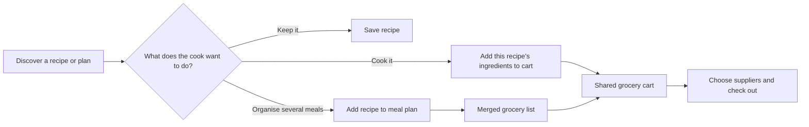

# Social Feed & Grocery UX Redesign

**Status:** Approved for implementation planning
**Date:** 2 August 2026
**Product:** Chef HideOut 私厨

## Purpose

Reframe Chef HideOut from a set of recipe, plan, and grocery utility pages into a social cooking app. The first job of the app is to make people want to discover recipes and follow cooks. Meal planning and grocery purchase stay close to that discovery journey, but never block it.

The resulting product loop is:

## Approved Product Decisions

### Social home

- **Home is a community recipe feed**, not a dashboard or catalogue.
- The feed has **For you** and **Following** tabs. The first can include public recipes, chef posts, community variations, and selected public meal plans; the second is limited to followed people.
- Recipe posts are the dominant feed unit. Public meal plans appear as less-frequent, richer cards, especially for festive, fitness, or shared-week content.
- Each recipe card prioritises the cook/chef, a food image, a concise personal caption, social actions, and a clear next action. Metadata is secondary.
- Existing social mechanics—follow, comment, save, ratings, chef attribution, and recipe variations—remain; the redesign makes them visible and coherent.

### Meal plans

- Meal plans are an **optional organiser**, not the only way to shop.
- The Plans area remains a main destination for users who want to organise a week, share goals, or publish a festive plan.
- A plan’s grocery list merges its ingredient requirements and can enter the same grocery cart as individual recipe additions.

### Grocery buying

- The grocery cart is a **universal, persistent cart**. Users can add ingredients from:
  1. one recipe;
  2. several recipes without making a plan; or
  3. a complete meal plan.
- The cart merges duplicate ingredients while preserving the source recipes or meal plan, so users understand why an item is present and can remove a source cleanly.
- The cart badge is visible in global navigation and displays a live item count.
- Checkout is deliberately designed for the roadmap’s staged fulfillment path: first concierge/manual ordering, then AI-assisted routing, then partner/API fulfillment. The cart UI must not imply live inventory before suppliers and integrations exist.

### Creation

- The global **Create** action opens a compact sheet rather than navigating directly to a single form.
- Its two initial options are:
  - **Add recipe** (primary): write an original recipe or import a recipe link.
  - **Start a meal plan** (secondary): create a private or eventually shareable plan.
- Recipe creation remains the primary option because Home is recipe-led. Both options are always available on mobile and desktop.

## Navigation and Responsive Shell

### Mobile

Use five persistent bottom-navigation destinations:

| Destination | Role |
|---|---|
| Home | Social feed, For you / Following tabs |
| Discover | Intentional search, categories, chefs, seasonal collections |
| Create | Opens the Add recipe / Start meal plan sheet |
| Plans | Personal plans and public-plan discovery entry point |
| Cart | Universal grocery cart and checkout path |

The header contains the Chef HideOut brand, the cart count, and the profile entry point. It does not duplicate the bottom navigation.

### Desktop

Use a compact top navigation:

- Brand at left.
- Home, Discover, and Plans at the centre/left.
- Create, Cart (with live count), and profile at right.
- On Home, the primary feed occupies the main column. A narrow supporting column shows the user’s next planned meals and cart summary. These panels are shortcuts, not a dashboard takeover.

## Feed and Card System

### Recipe post card

The card sequence is:

1. Cook/chef identity, time, and overflow/report action.
2. Prominent dish image.
3. Like, comment, share, and save controls.
4. A clear ingredient action: **Add ingredients** or **Add to cart**.
5. Short personal caption and optional cultural/dietary tags.
6. A secondary **Make it yours** action for public recipes, preserving the approved variation and attribution model.

Recipe cards should feel like social posts, not product tiles: lighter metadata, stronger image/cook/caption hierarchy, and clear social feedback. Imported-photo publishing restrictions and AI-image badges remain visibly enforced.

### Meal-plan card

Meal-plan cards show the creator, the plan goal or festival tag, a compact preview of dishes and period, comment count, and two actions:

- View plan
- Add plan ingredients to cart

They must not be rendered at the same frequency or visual weight as recipes in Home. Recipes remain the main reason to scroll.

### Discovery

Discover is the deliberate-browse companion to Home. It retains recipe category, cuisine, chef, seasonal/festival, and search controls, but presents them as invitation-led collections rather than a dense filter wall. It is the appropriate place for more structured browsing; Home stays light and social.

## Cart Experience

### Cart contents

- Group ingredients by source recipe or meal plan initially, with an option to view the consolidated grocery grouping.
- Show normalized quantity, unit, source, and a remove action for each item/source.
- When two sources require the same ingredient, show the combined amount with a small source disclosure.
- Preserve existing AI grocery-list consolidation as the consolidation engine. The UI should make the result legible rather than expose raw ingredient lines.

### Cart progression

1. **Review cart** — quantities, sources, substitutions, and remove actions.
2. **Choose sources** — wet-market supplier, partner supermarket, or a later concierge default.
3. **Confirm availability and final total** — manual/concierge in the first pilot; do not label it live inventory unless it is live.
4. **Pay and fulfill** — only after HitPay and signed supplier prerequisites exist.

Until Phase 2 prerequisites exist, the cart can support saving/reviewing ingredients and show a clear, honest availability state. It must not offer a fake checkout.

## Visual Direction

- **Tone:** warm, food-first, human, and local—not generic SaaS or a dark utility dashboard.
- **Primary accent:** a warm coral for high-intent recipe/community actions.
- **Supporting accent:** leaf green for cart and grocery actions, which makes shopping recognisable without competing with food imagery.
- **Surfaces:** soft cream/off-white in light mode with subdued, warm dark mode equivalents. Avoid large cool zinc surfaces and indigo being the only visual identity.
- **Type and spacing:** calm, editorial hierarchy; generous image space; compact but readable metadata; touch targets that work on a phone.
- **Photography:** food imagery is the visual anchor. Preserve image-source and AI-image labels for copyright clarity.
- **Accessibility:** semantic navigation, visible labels alongside icons, keyboard navigation on desktop, clear focus states, sufficient contrast, and no colour-only status information.

## Data and Implementation Boundaries

This document specifies experience, not a new backend. The redesign should reuse current data where possible:

| Existing capability | Redesign role |
|---|---|
| `recipes`, follows, saves, comments, ratings, variations | Recipe feed and social post actions |
| `meal_plans`, slots, comments, festival tags | Optional planning and shareable plan posts |
| `grocery_lists`, `grocery_items`, AI consolidation | Ingredient consolidation and cart foundations |
| Chef/profile data | Creator identity, following, and discoverability |

The universal cart will require a dedicated cart data model during implementation, rather than overloading a single plan-bound `grocery_list`. Its exact schema belongs in the implementation plan. It must support multiple recipe sources, optional meal-plan source, consolidated items, and a future checkout state.

All new user-facing copy must be bilingual English / Simplified Chinese. Recipe content translation, formal marketplace payments, inventory integrations, and Traditional Chinese remain scoped according to `FEATURES.md` and `ROADMAP.md`.

## Out of Scope for This Redesign Slice

- Live supermarket inventory or public supermarket API integrations.
- Payment capture, vouchers, order routing, or delivery logistics.
- A new generic social-post data type separate from recipes and meal plans.
- Native app development.
- Replacing the existing import, fork, or nutrition engines.

## Implementation Sequence

1. Establish the responsive social app shell and replace the current utility-page navigation.
2. Rebuild Home as the social recipe feed using existing public recipes and social actions.
3. Rework recipe and meal-plan cards to the approved hierarchy and actions.
4. Introduce the Create sheet and route to existing recipe/plan creation paths.
5. Reshape Plans and Discover to match their focused roles.
6. Design and implement the universal cart data model and UI behind feature-gated checkout states.
7. Connect supplier/checkout capabilities only when the Phase 2 business prerequisites are met.

## Acceptance Criteria

- A new user can open Home and immediately understand that this is a social recipe community.
- A user can save, comment on, follow, vary, or add a public recipe’s ingredients to a cart from the discovery flow.
- A user can buy ingredients for one recipe, several recipe selections, or a meal plan without being forced into a different workflow.
- A user can still create a recipe or a meal plan from one global Create entry point.
- Meal planning, cart, and discoverability work comfortably on mobile and desktop.
- No visual or copy change weakens existing attribution, publish-policy, privacy, or bilingual requirements.
